# VibeGraph - Use Case Diagrams

Tài liệu này chứa tất cả các biểu đồ Use Case (Use Case Diagrams) cho dự án VibeGraph, được viết bằng cú pháp PlantUML.

## 2.1. Use Case Tổng quát

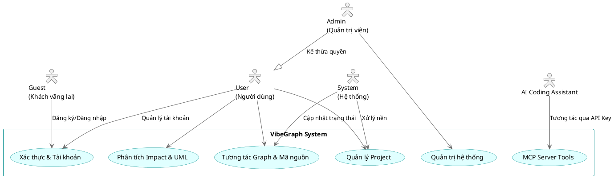

## 2.2. UC: Đăng ký & Đăng nhập (Guest)

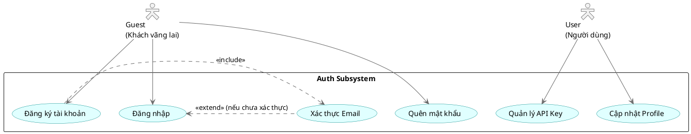

## 2.3. UC: Quản lý Project (User)

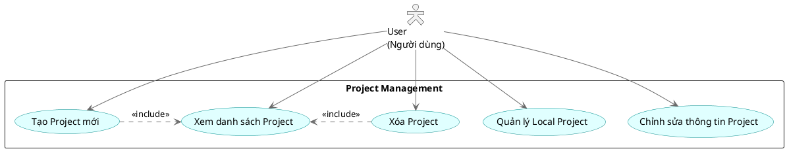

## 2.4. UC: Import Project - 3 luồng (User)

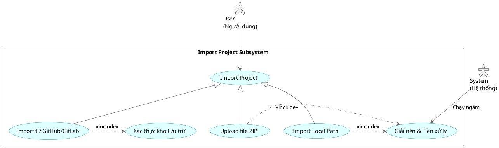

## 2.5. UC: Phân tích mã nguồn (User, System)

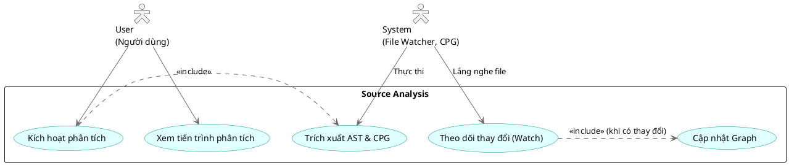

## 2.6. UC: Xem & Tương tác Graph (User)

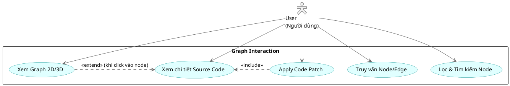

## 2.7. UC: Xem UML Diagram (User)

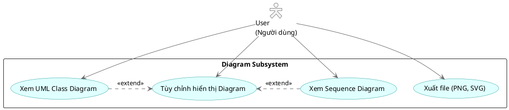

## 2.8. UC: Impact Analysis (User)

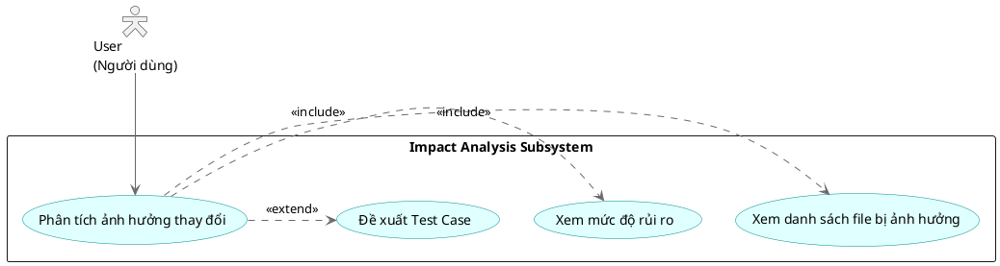

## 2.9. UC: MCP Server (AI Assistant)

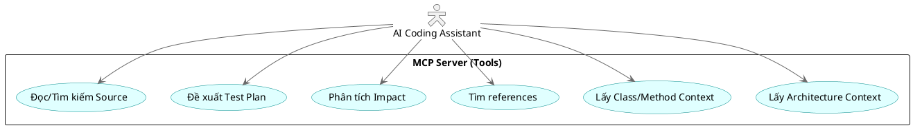

## 2.10. UC: Quản trị hệ thống (Admin)

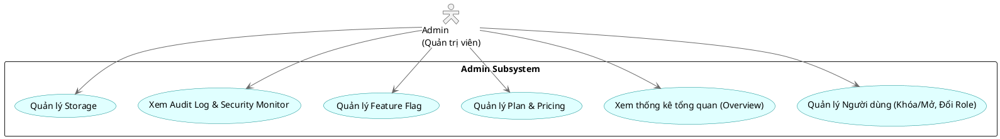
# VibeGraph Activity Diagrams

Tài liệu này chứa các sơ đồ hoạt động (Activity Diagrams) mô tả các luồng nghiệp vụ chính của dự án VibeGraph.

## Diagram 3.1: Đăng ký → Đăng nhập → Xác thực JWT

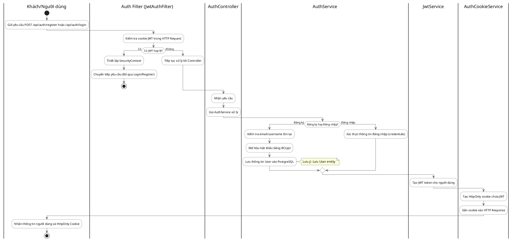

## Diagram 3.2: Import Project

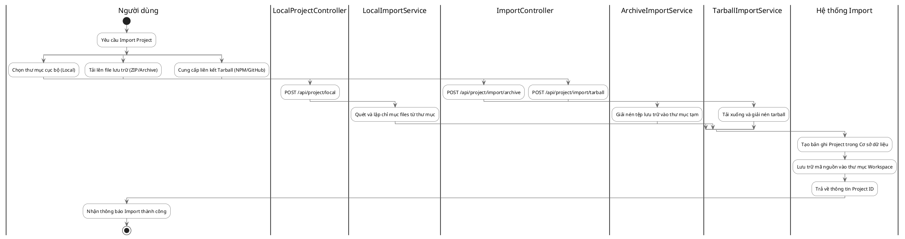

## Diagram 3.3: Phân tích mã nguồn (Analyze)

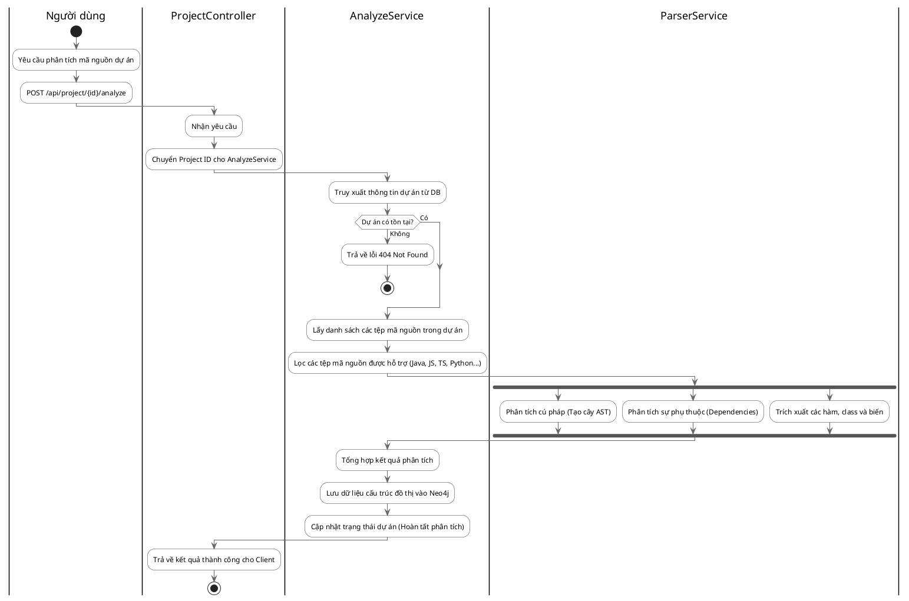

## Diagram 3.4: Realtime Update (File Watcher)

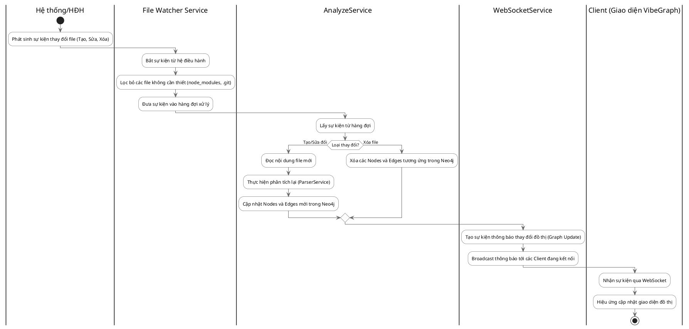

## Diagram 3.5: AI Tool gọi MCP

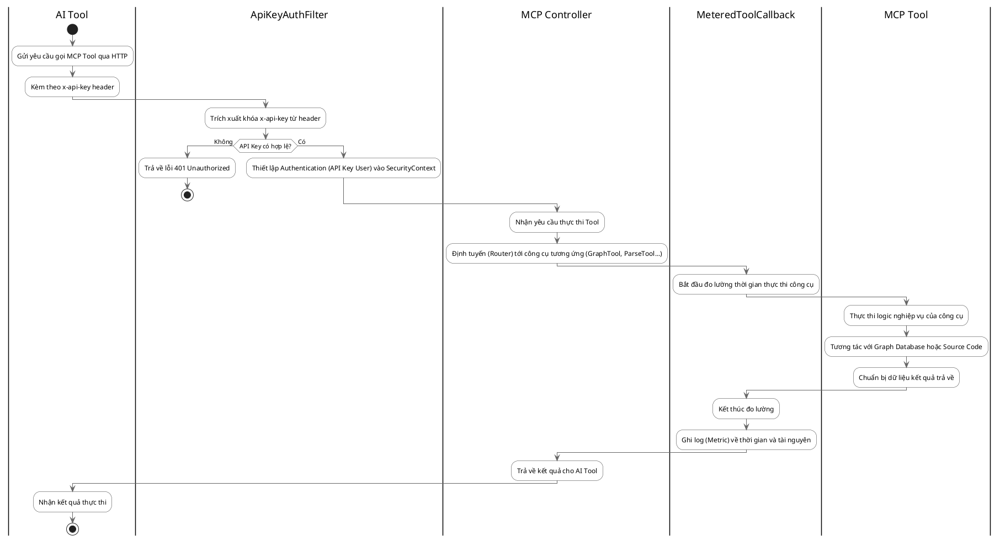

## Diagram 3.6: Admin quản lý người dùng

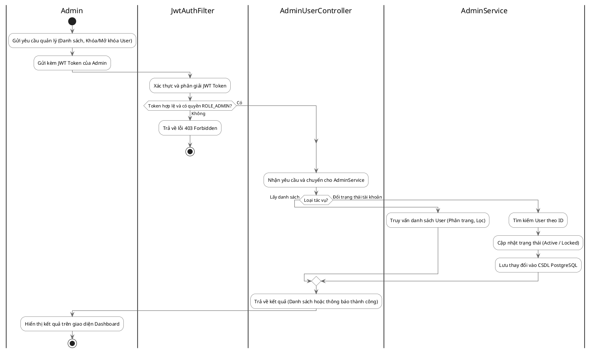
# VibeGraph - Architecture & Database Diagrams

Tài liệu này chứa toàn bộ các biểu đồ ERD (PostgreSQL & Neo4j), Component/Deployment và Class Diagrams cho hệ thống VibeGraph, được định dạng bằng cú pháp PlantUML.

## PART 1: ERD PostgreSQL

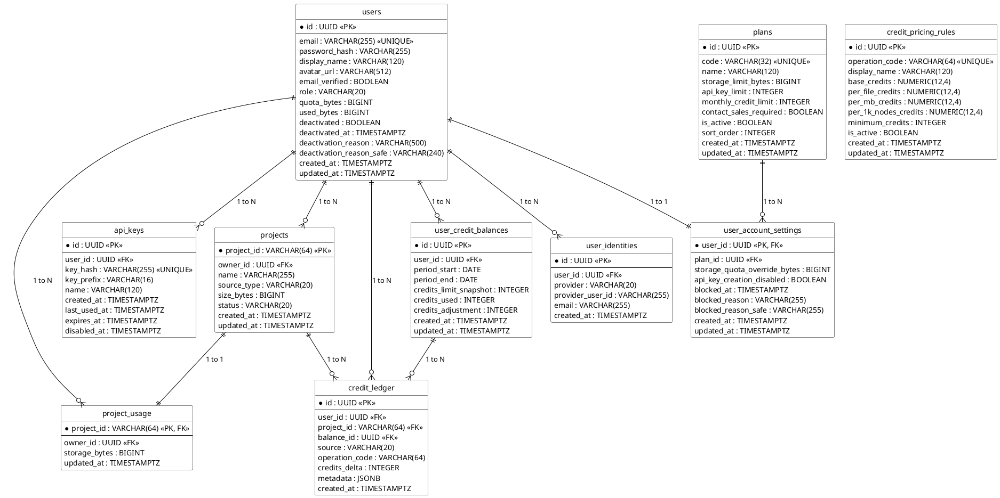

## PART 2: ERD Neo4j

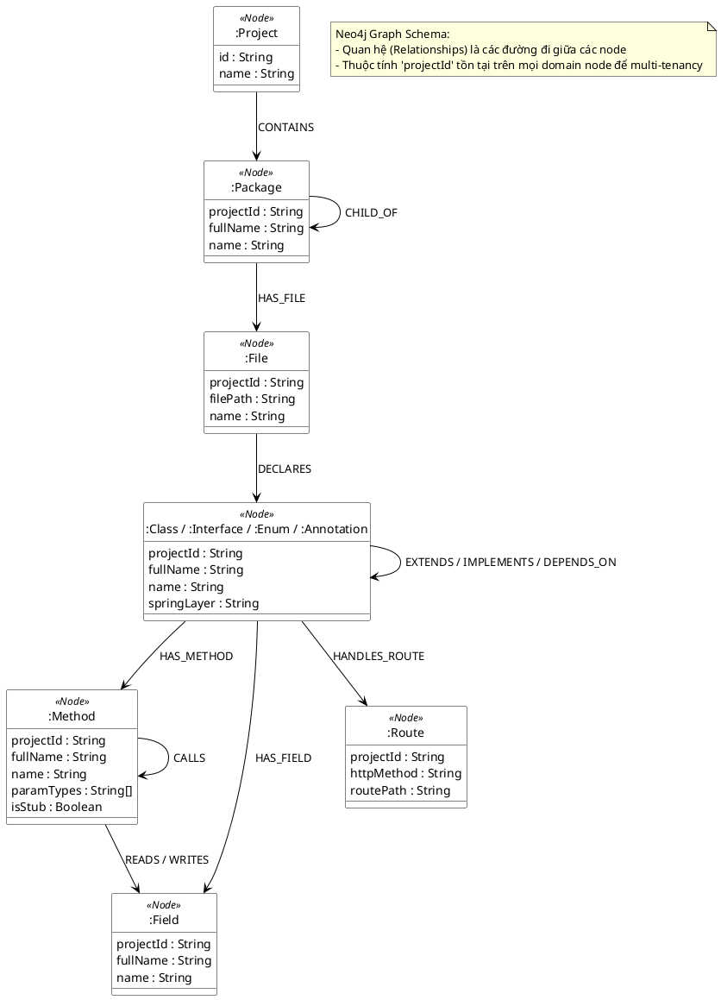

## PART 3: Component/Deployment Diagram

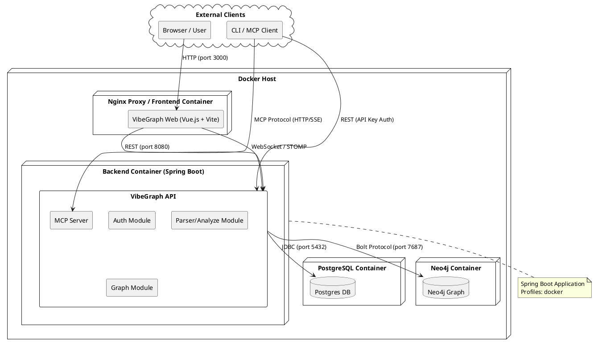

## PART 4: Class Diagram - Auth Module

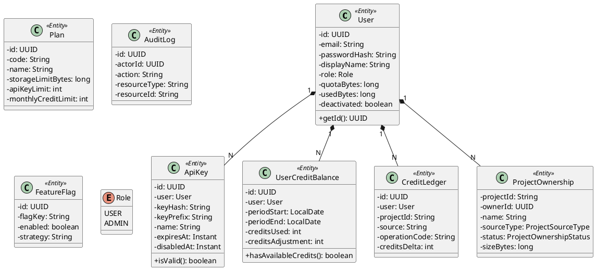

## PART 5: Class Diagram - Graph/Parser Module

```plantuml
@startuml
skinparam handwritten false
skinparam classAttributeIconSize 0

package "com.vibegraph.parser.node" {
  class NodeData <<Record>> {
    + type: String
    + name: String
    + fullName: String
    + filePath: String
    + lineNumber: int
    + endLine: int
    + properties: Map<String, Object>
  }
  
  class EdgeData <<Record>> {
    + type: String
    + sourceFullName: String
    + targetFullName: String
    + properties: Map<String, Object>
  }
  
  class ParseResult <<Record>> {
    + nodes: List<NodeData>
    + edges: List<EdgeData>
  }
}

package "com.vibegraph.parser.service" {
  interface ParserService {
    + parse(projectPath: Path): ParseResult
  }
  
  class AnalyzeService {
    + analyzeProject(projectId: String, sourcePath: Path): void
  }
}

package "com.vibegraph.graph.repository" {
  interface GraphRepository {
    + saveGraph(projectId: String, nodes: List<NodeData>, edges: List<EdgeData>): void
    + deleteProjectGraph(projectId: String): void
    + queryNodes(query: String): List<NodeData>
  }
}

package "com.vibegraph.graph.service" {
  class GraphService {
    + getProjectGraph(projectId: String): GraphDto
    + getProjectMetrics(projectId: String): MetricsDto
  }
  
  class ProjectService {
    + importArchive(userId: UUID, file: MultipartFile): ProjectOwnership
    + updateProjectStatus(projectId: String, status: String): void
  }
}

AnalyzeService ..> ParserService : uses
AnalyzeService ..> GraphRepository : uses
ParseResult *-- NodeData
ParseResult *-- EdgeData
GraphService ..> GraphRepository : uses
ProjectService ..> AnalyzeService : triggers

@enduml
```
