# VibeGraph - Verified Use Case Diagrams

These diagrams describe capabilities evidenced by the current source/configuration. They do
not reproduce unsupported claims from the previous report. Evidence references use the
repository-relative `path:line` form.

## 2.1. Current system boundary

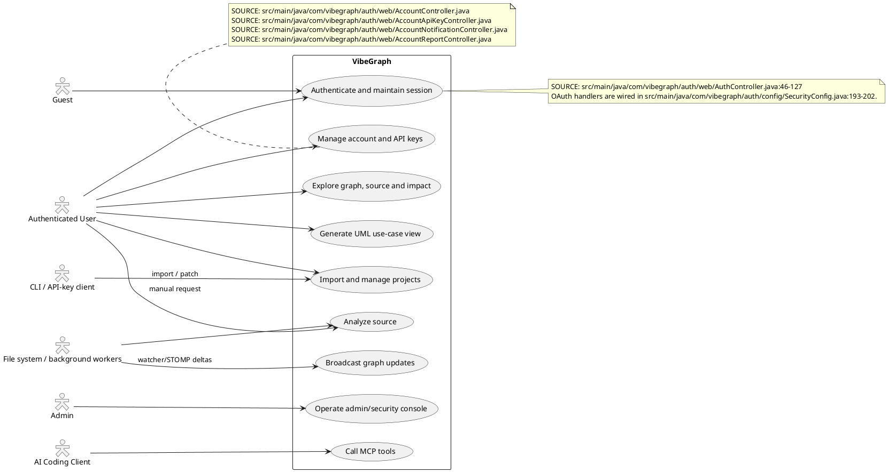

## 2.2. Authentication and account

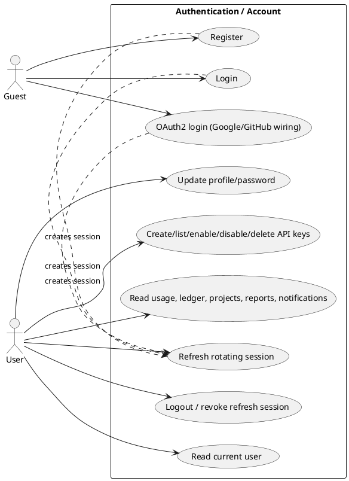

## 2.3. Project lifecycle and import

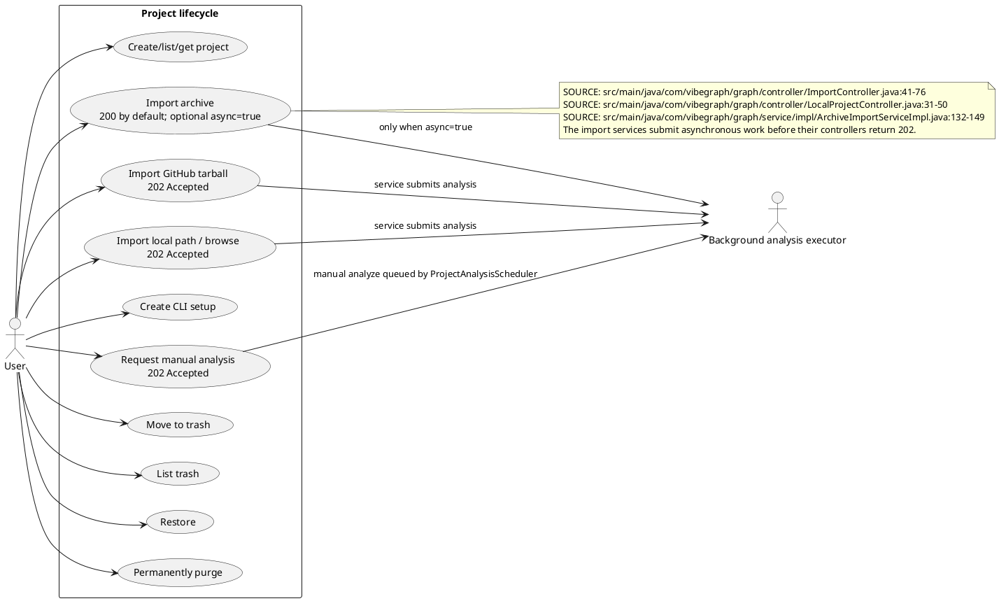

## 2.4. Source analysis and realtime

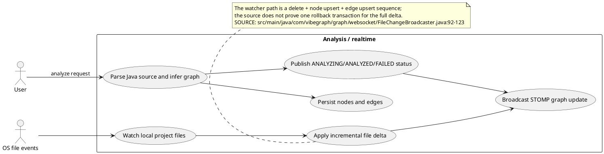

## 2.5. Graph, source, patch and UML

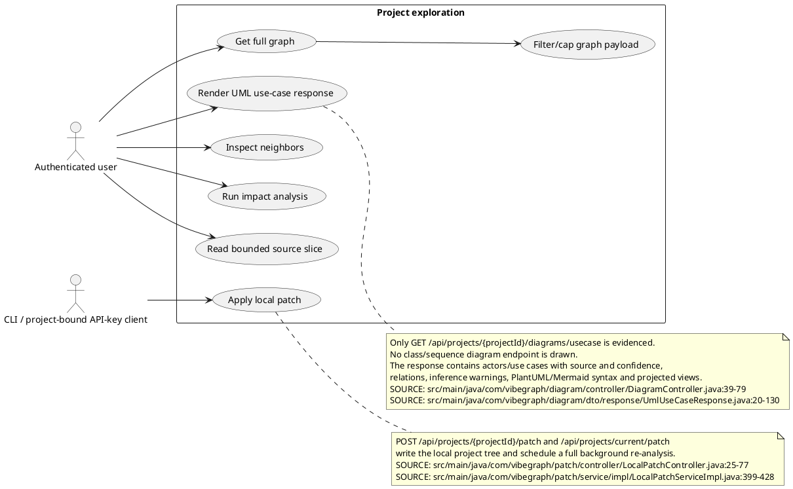

## 2.6. MCP and AI client

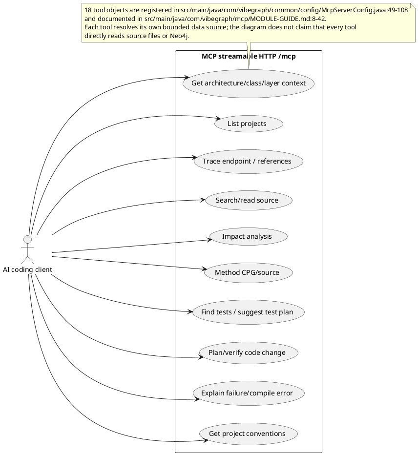

## 2.7. Admin and security operations

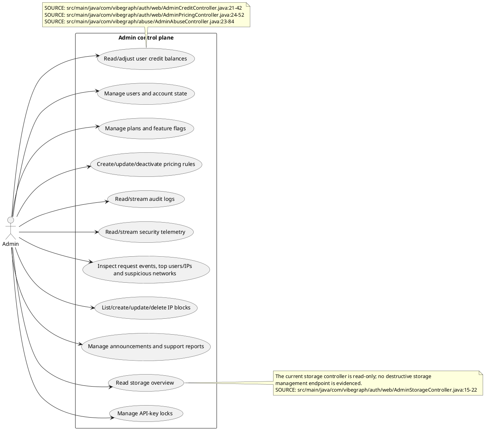

## Not drawn as current behavior

The old diagrams mention forgot-password, email verification, GitLab import, class/sequence
diagram generation, broad PNG/SVG export, and a 3D graph. Repository search found no current
endpoint/service contract proving those features, so they are documented as stale in
`changes/usecase.changes.md` rather than represented as live use cases.
# VibeGraph - Activity Diagrams (Sơ Đồ Hoạt Động)

Tài liệu này chứa toàn bộ các biểu đồ Hoạt động mô tả luồng nghiệp vụ thực tế của hệ thống VibeGraph, tuân thủ đúng lý thuyết UML với hình thoi khởi đầu (Decision Node) và hình thoi hội tụ (Merge Node).

## 3.1. Đăng ký, Đăng nhập, OAuth2 và Refresh Session

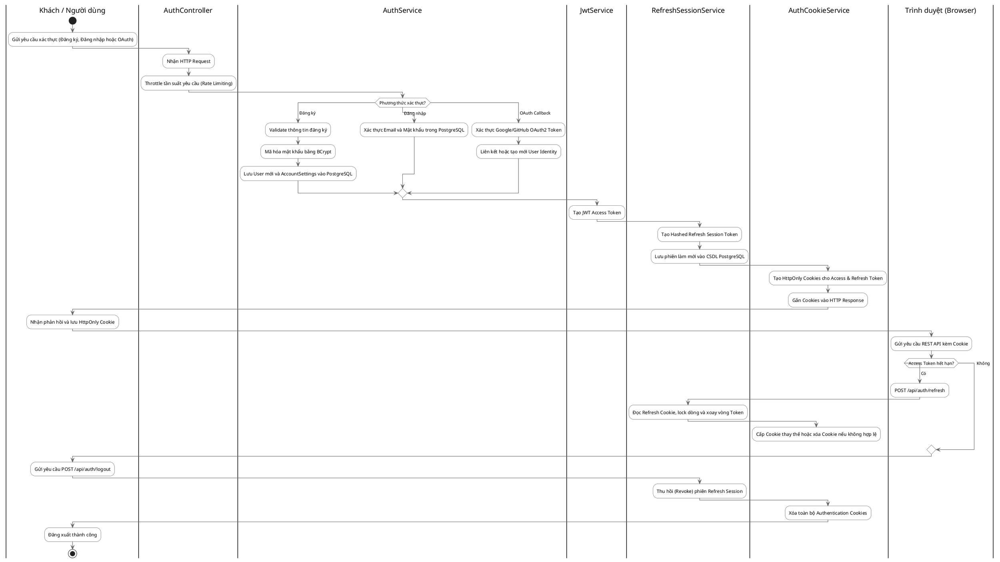

## 3.2. Import Project (Archive, GitHub, Local) và Phân tích bất đồng bộ

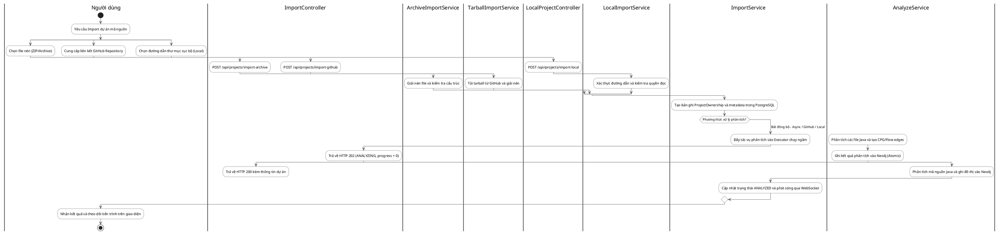

## 3.3. File Watcher - Cập nhật tăng dần (Incremental Update)

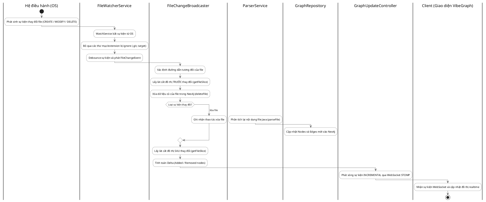

## 3.4. Khám phá Đồ thị / Mã nguồn & Cập nhật qua CLI Patch

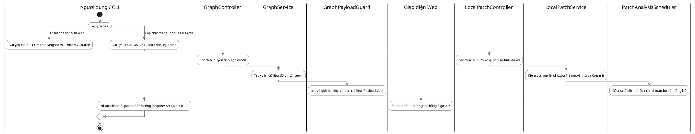

## 3.5. Tự động sinh sơ đồ UML (Use Case Diagram)

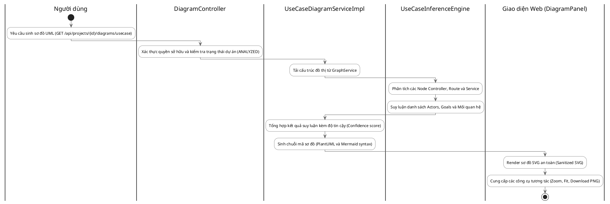

## 3.6. AI Assistant gọi MCP Server & Giám sát Admin

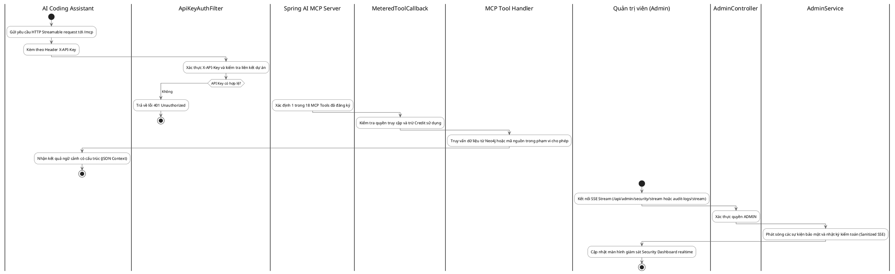
# VibeGraph - Verified ERD, Component and Class Diagrams

## PART 1: PostgreSQL control-plane ERD

```plantuml
@startuml
hide circle
skinparam linetype ortho

entity users {
  * id : UUID <<PK>>
  --
  * email : VARCHAR
  password_hash : VARCHAR
  display_name : VARCHAR
  avatar_url : VARCHAR
  email_verified : BOOLEAN
  role : VARCHAR
  quota_bytes : BIGINT
  used_bytes : BIGINT
  deactivated : BOOLEAN
  deactivated_at : TIMESTAMPTZ
  deactivation_reason : VARCHAR
  deactivation_reason_safe : VARCHAR
  created_at : TIMESTAMPTZ
  updated_at : TIMESTAMPTZ
}
entity user_identities {
  * id : UUID <<PK>>
  user_id : UUID <<FK>>
  provider : VARCHAR
  provider_user_id : VARCHAR
  email : VARCHAR
  created_at : TIMESTAMPTZ
}
entity projects {
  * project_id : VARCHAR <<PK>>
  owner_id : UUID <<FK>>
  name : VARCHAR
  source_type : VARCHAR
  size_bytes : BIGINT
  status : VARCHAR
  deleted_at : TIMESTAMPTZ
  created_at : TIMESTAMPTZ
  updated_at : TIMESTAMPTZ
}
entity api_keys {
  * id : UUID <<PK>>
  user_id : UUID <<FK>>
  project_id : VARCHAR <<FK>>
  key_hash : VARCHAR <<UNIQUE>>
  key_prefix : VARCHAR
  name : VARCHAR
  created_at : TIMESTAMPTZ
  last_used_at : TIMESTAMPTZ
  expires_at : TIMESTAMPTZ
  disabled_at : TIMESTAMPTZ
  deleted_at : TIMESTAMPTZ
  disabled_by : VARCHAR
  disabled_reason : VARCHAR
  locked_by : VARCHAR
}
entity plans {
  * id : UUID <<PK>>
  code : VARCHAR <<UNIQUE>>
  name : VARCHAR
  storage_limit_bytes : BIGINT
  api_key_limit : INTEGER
  monthly_credit_limit : INTEGER
  contact_sales_required : BOOLEAN
  is_active : BOOLEAN
  sort_order : INTEGER
  created_at : TIMESTAMPTZ
  updated_at : TIMESTAMPTZ
}
entity user_account_settings {
  * user_id : UUID <<PK/FK>>
  plan_id : UUID <<FK>>
  storage_quota_override_bytes : BIGINT
  credit_quota_override : INTEGER
  api_key_creation_disabled : BOOLEAN
  blocked_at : TIMESTAMPTZ
  blocked_reason : VARCHAR
  blocked_reason_safe : VARCHAR
  created_at : TIMESTAMPTZ
  updated_at : TIMESTAMPTZ
}
entity project_usage {
  * project_id : VARCHAR <<PK/FK>>
  owner_id : UUID <<FK>>
  storage_bytes : BIGINT
  updated_at : TIMESTAMPTZ
}
entity user_credit_balances {
  * id : UUID <<PK>>
  user_id : UUID <<FK>>
  period_start : DATE
  period_end : DATE
  credits_limit_snapshot : INTEGER
  credits_used : INTEGER
  credits_adjustment : INTEGER
  created_at : TIMESTAMPTZ
  updated_at : TIMESTAMPTZ
}
entity credit_pricing_rules {
  * id : UUID <<PK>>
  operation_code : VARCHAR <<UNIQUE>>
  display_name : VARCHAR
  base_credits : NUMERIC
  per_file_credits : NUMERIC
  per_mb_credits : NUMERIC
  per_1k_nodes_credits : NUMERIC
  minimum_credits : INTEGER
  is_active : BOOLEAN
  created_at : TIMESTAMPTZ
  updated_at : TIMESTAMPTZ
}
entity credit_ledger {
  * id : UUID <<PK>>
  user_id : UUID <<FK>>
  project_id : VARCHAR <<FK>>
  balance_id : UUID <<FK>>
  source : VARCHAR
  operation_code : VARCHAR
  credits_delta : INTEGER
  metadata : JSONB
  created_at : TIMESTAMPTZ
}
entity feature_flags {
  * id : UUID <<PK>>
  flag_key : VARCHAR <<UNIQUE>>
  scope : VARCHAR
  display_name : VARCHAR
  description : VARCHAR
  enabled : BOOLEAN
  created_at : TIMESTAMPTZ
  updated_at : TIMESTAMPTZ
}
entity announcements {
  * id : UUID <<PK>>
  type : VARCHAR
  severity : VARCHAR
  target : VARCHAR
  title : VARCHAR
  body : VARCHAR
  starts_at : TIMESTAMPTZ
  ends_at : TIMESTAMPTZ
  dismissible : BOOLEAN
  active : BOOLEAN
  created_by_user_id : UUID <<FK>>
  created_at : TIMESTAMPTZ
  updated_at : TIMESTAMPTZ
}
entity user_notifications {
  * id : UUID <<PK>>
  user_id : UUID <<FK>>
  announcement_id : UUID <<FK>>
  read_at : TIMESTAMPTZ
  dismissed_at : TIMESTAMPTZ
  created_at : TIMESTAMPTZ
}
entity feedback_reports {
  * id : UUID <<PK>>
  user_id : UUID <<FK>>
  status : VARCHAR
  category : VARCHAR
  title : VARCHAR
  delete_after : TIMESTAMPTZ
  created_at : TIMESTAMPTZ
  closed_at : TIMESTAMPTZ
}
entity feedback_messages {
  * id : UUID <<PK>>
  report_id : UUID <<FK>>
  sender_user_id : UUID <<FK>>
  sender_role : VARCHAR
  body : TEXT
  created_at : TIMESTAMPTZ
}
entity security_events {
  * id : UUID <<PK>>
  event_type : VARCHAR
  severity : VARCHAR
  subject_user_id : UUID <<FK>>
  api_key_ref : VARCHAR
  source : VARCHAR
  description : VARCHAR
  created_at : TIMESTAMPTZ
}
entity request_events {
  * id : UUID <<PK>>
  user_id : UUID <<FK>>
  api_key_ref : VARCHAR
  ip_address : VARCHAR
  route : VARCHAR
  http_method : VARCHAR
  status : INTEGER
  event_type : VARCHAR
  occurred_at : TIMESTAMPTZ
}
entity ip_blocks {
  * id : UUID <<PK>>
  ip_address : VARCHAR <<UNIQUE>>
  safe_reason : VARCHAR
  expires_at : TIMESTAMPTZ
  created_by : UUID <<FK>>
  active : BOOLEAN
  created_at : TIMESTAMPTZ
  updated_at : TIMESTAMPTZ
}
entity audit_logs {
  * id : UUID <<PK>>
  action : VARCHAR
  actor_user_id : UUID <<logical ref; no FK after V15>>
  target_user_id : UUID <<logical ref; no FK after V15>>
  target_type : VARCHAR
  target_id : VARCHAR
  outcome : VARCHAR
  ip_address : VARCHAR
  details : VARCHAR
  created_at : TIMESTAMPTZ
}
entity audit_retention_settings {
  * id : SMALLINT <<PK>>
  retention_days : INTEGER
  updated_by : UUID <<FK>>
  updated_at : TIMESTAMPTZ
}
entity refresh_sessions {
  * id : UUID <<PK>>
  user_id : UUID <<FK>>
  family_id : UUID
  token_hash : VARCHAR <<UNIQUE>>
  expires_at : TIMESTAMPTZ
  last_used_at : TIMESTAMPTZ
  revoked_at : TIMESTAMPTZ
  revoke_reason : VARCHAR
  replaced_by_id : UUID
  created_at : TIMESTAMPTZ
}

users ||--o{ user_identities
users ||--o{ projects
users ||--o{ api_keys
projects |o--o{ api_keys
users ||--o| user_account_settings
plans ||--o{ user_account_settings
projects ||--o| project_usage
users ||--o{ project_usage
users ||--o{ user_credit_balances
users ||--o{ credit_ledger
projects |o--o{ credit_ledger
user_credit_balances |o--o{ credit_ledger
users |o--o{ announcements : created_by
users ||--o{ user_notifications
announcements ||--o{ user_notifications
users |o--o{ feedback_reports
feedback_reports ||--o{ feedback_messages
users |o--o{ feedback_messages
users |o--o{ security_events
users |o--o{ request_events
users |o--o{ ip_blocks : created_by
users |o--o{ audit_retention_settings : updated_by
users ||--o{ refresh_sessions

note bottom
MIGRATION: src/main/resources/db/migration/V1..V20__*.sql
RUNTIME 2026-08-14T10:12:42+07:00: 21 domain tables, 23 FK relations,
66 domain-table indexes (68 public-schema indexes including 2 Flyway indexes),
and 19 successful Flyway migrations.
Important unique indexes: uq_users_email_lower, uq_identity_provider_uid,
uq_credit_balance_user_period, uq_user_notifications_user_announcement,
and partial uq_api_keys_live_user_project.
end note
@enduml
```

## PART 2: Neo4j graph schema and observed runtime vocabulary

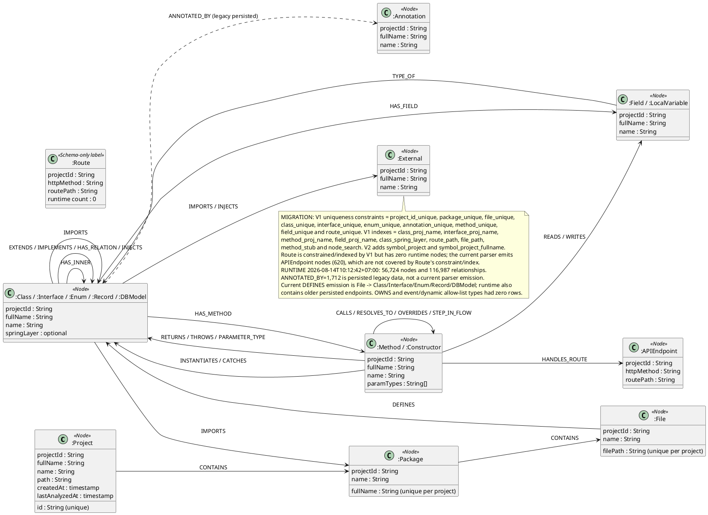

## PART 3: Component and deployment

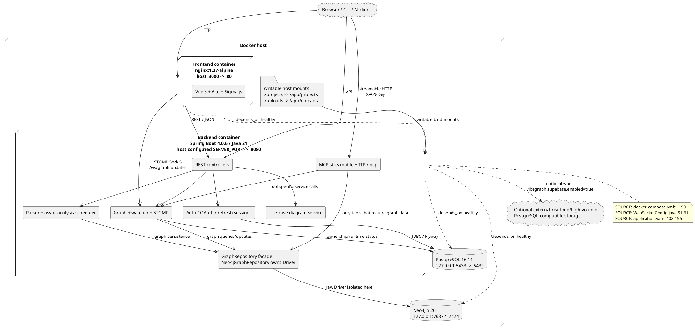

## PART 4: Auth/control-plane class view

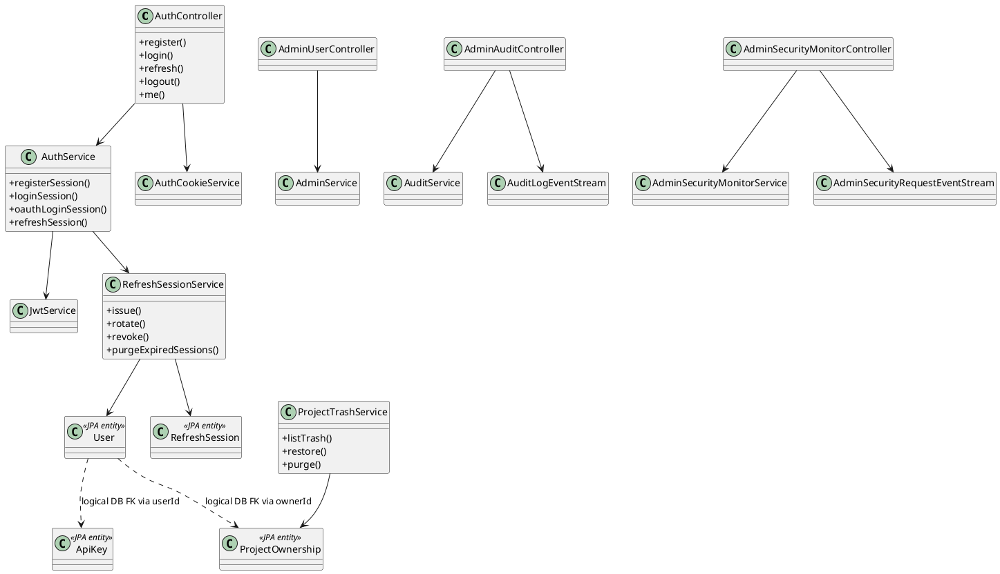

## PART 5: Graph/parser/diagram/MCP class view

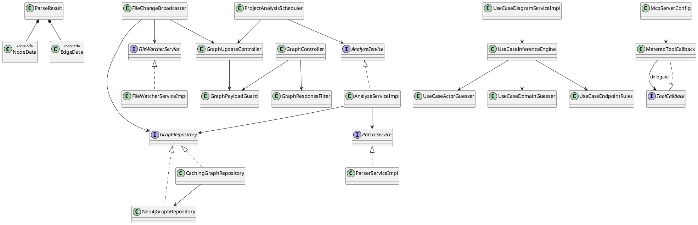

The class views are verified compact module views, not an exhaustive rendering of all 17,907
indexed symbols. `Plan`, `UserCreditBalance`, `CreditLedger`, `AuditLog`, `FeatureFlag`, `Role`,
`GraphService` and `ProjectService` remain in production code but are omitted from these compact
slices. Exact source locations and old-versus-current decisions are in the change notes.
