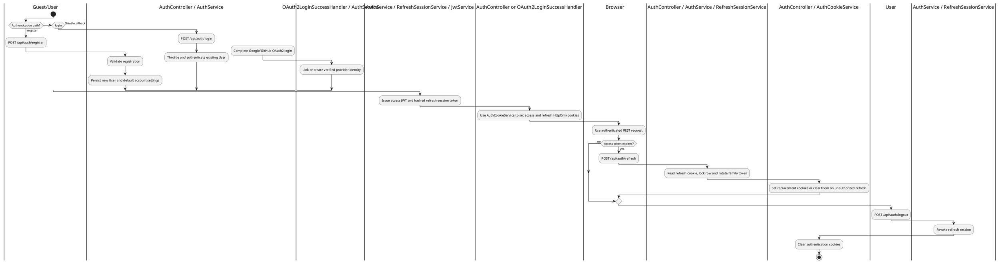
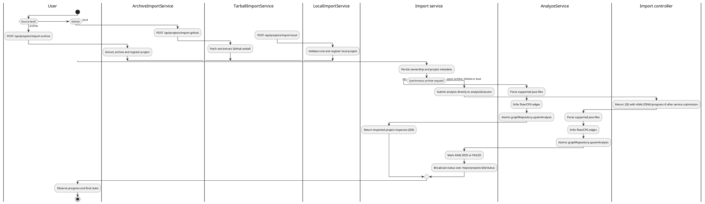
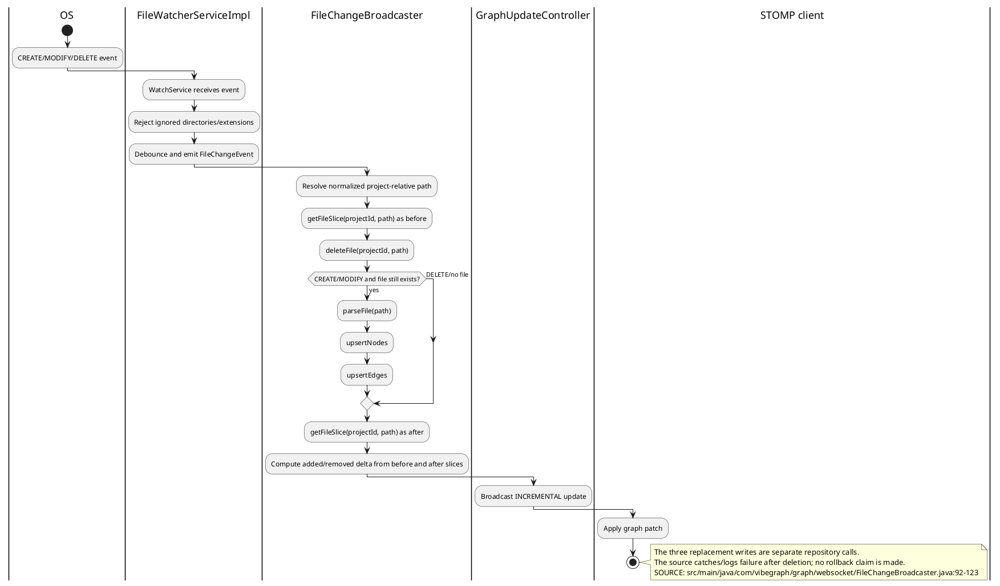
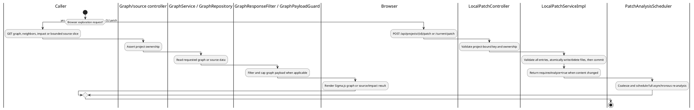
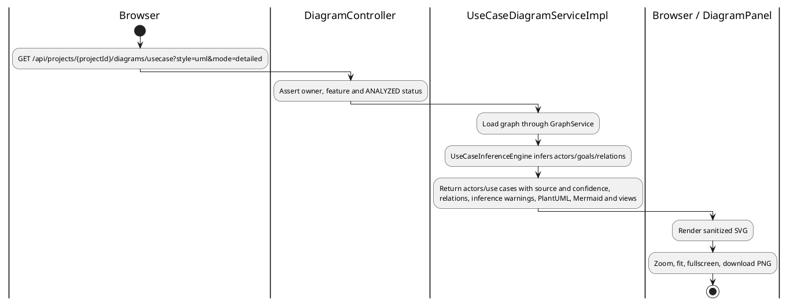
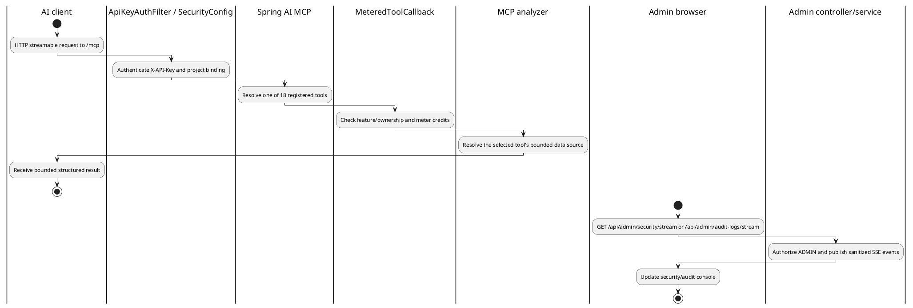

# VibeGraph - Verified Activity Diagrams

## 3.1. Local login, OAuth and rotating refresh session

Evidence: `src/main/java/com/vibegraph/auth/web/AuthController.java:60-135`,
`src/main/java/com/vibegraph/auth/service/AuthService.java:82-208`,
`src/main/java/com/vibegraph/auth/oauth/OAuth2LoginSuccessHandler.java:39-66`,
`src/main/java/com/vibegraph/auth/service/RefreshSessionService.java:76-116`, migrations
`src/main/resources/db/migration/V18__refresh_sessions.sql` and
`src/main/resources/db/migration/V19__refresh_session_retention.sql`.

## 3.2. Import and asynchronous analysis

Evidence: `src/main/java/com/vibegraph/graph/controller/ImportController.java:29-76`,
`src/main/java/com/vibegraph/graph/controller/LocalProjectController.java:31-50`,
`src/main/java/com/vibegraph/graph/service/impl/ArchiveImportServiceImpl.java:132-149`,
`src/main/java/com/vibegraph/graph/service/impl/TarballImportServiceImpl.java:135-148`,
`src/main/java/com/vibegraph/graph/service/impl/LocalImportServiceImpl.java:122-171`,
`src/main/java/com/vibegraph/graph/service/impl/AnalyzeServiceImpl.java:39-120`.

Manual `POST /api/projects/{id}/analyze` is a separate path:
`src/main/java/com/vibegraph/graph/controller/ProjectController.java:105-121` queues
`src/main/java/com/vibegraph/graph/service/ProjectAnalysisScheduler.java:55-105`, which
coalesces duplicate manual requests.

## 3.3. File watcher incremental update

## 3.4. Graph/source/impact and CLI patch requests

Evidence: `src/main/java/com/vibegraph/graph/controller/GraphController.java:27-136`,
`src/main/java/com/vibegraph/graph/service/impl/GraphResponseFilter.java:25-176`,
`src/main/java/com/vibegraph/graph/service/impl/GraphPayloadGuard.java:25-153`,
`src/main/java/com/vibegraph/graph/controller/SourceController.java:29-53`,
`src/main/java/com/vibegraph/patch/controller/LocalPatchController.java:25-77`,
`src/main/java/com/vibegraph/patch/service/impl/LocalPatchServiceImpl.java:399-428`,
`src/main/java/com/vibegraph/patch/service/PatchAnalysisScheduler.java:21-102`,
`vibegraph-web/src/components/graph/GraphCanvas.vue` and
`vibegraph-web/src/lib/api.ts:346-516`. No frontend caller for the local patch endpoint is
claimed; the controller documents it as a CLI/API-key flow.

## 3.5. Use-case UML response

Evidence: `src/main/java/com/vibegraph/diagram/controller/DiagramController.java:39-79`,
`src/main/java/com/vibegraph/diagram/service/impl/UseCaseDiagramServiceImpl.java:35-116`,
`src/main/java/com/vibegraph/diagram/service/impl/UseCaseInferenceEngine.java`,
`vibegraph-web/src/components/diagram/DiagramPanel.vue:347-596`,
`vibegraph-web/src/lib/api.ts:518-596`.

## 3.6. MCP and admin event streams

Evidence: `src/main/java/com/vibegraph/common/config/McpServerConfig.java:49-108`,
`src/main/java/com/vibegraph/mcp/MODULE-GUIDE.md:8-42`,
`src/main/java/com/vibegraph/auth/web/ApiKeyAuthFilter.java:100-124`,
`src/main/java/com/vibegraph/auth/config/SecurityConfig.java:175-191`,
`src/main/java/com/vibegraph/auth/web/AdminSecurityMonitorController.java:20-33`,
`src/main/java/com/vibegraph/auth/web/AdminAuditController.java:31-73`.
