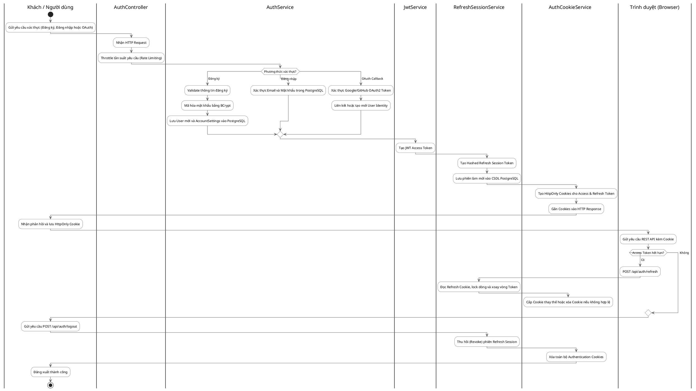
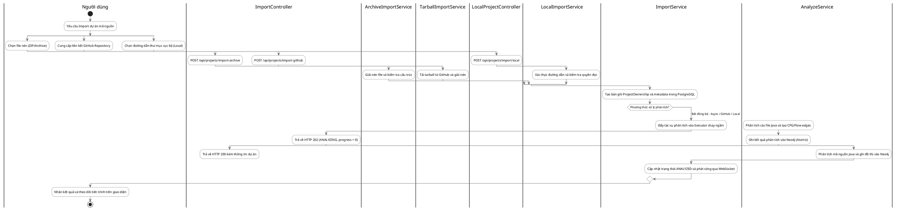
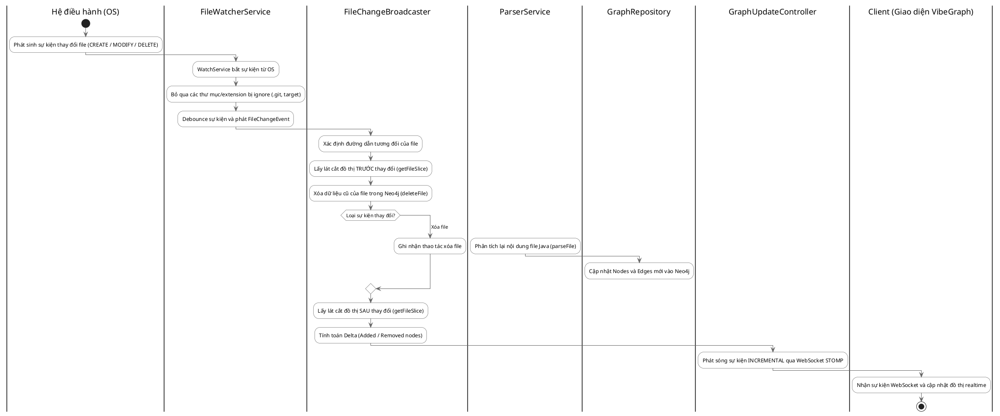
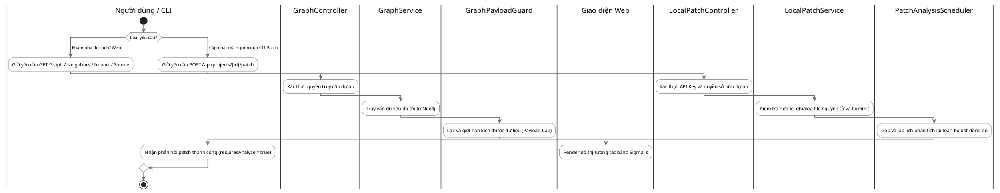
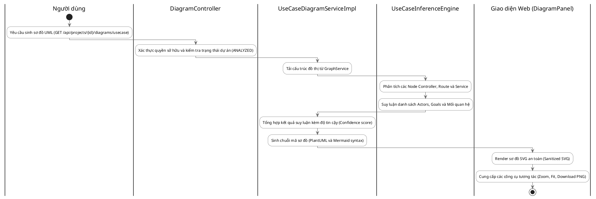
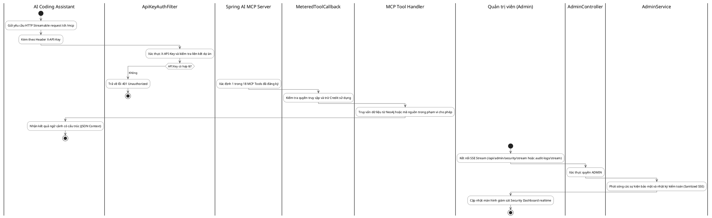

# VibeGraph - Activity Diagrams (Sơ Đồ Hoạt Động)

Tài liệu này chứa toàn bộ các biểu đồ Hoạt động mô tả luồng nghiệp vụ thực tế của hệ thống VibeGraph, tuân thủ đúng lý thuyết UML với hình thoi khởi đầu (Decision Node) và hình thoi hội tụ (Merge Node).

## 3.1. Đăng ký, Đăng nhập, OAuth2 và Refresh Session

## 3.2. Import Project (Archive, GitHub, Local) và Phân tích bất đồng bộ

## 3.3. File Watcher - Cập nhật tăng dần (Incremental Update)

## 3.4. Khám phá Đồ thị / Mã nguồn & Cập nhật qua CLI Patch

## 3.5. Tự động sinh sơ đồ UML (Use Case Diagram)

## 3.6. AI Assistant gọi MCP Server & Giám sát Admin

