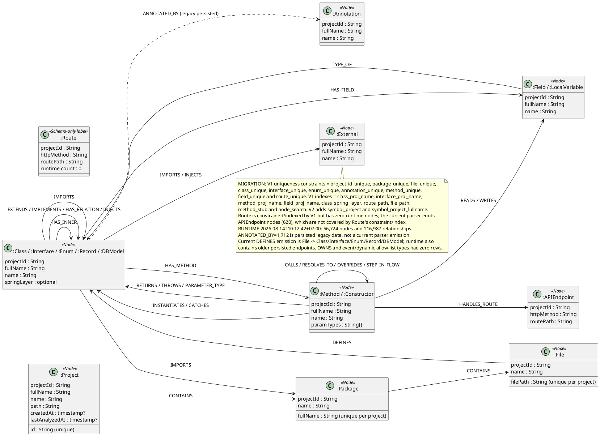
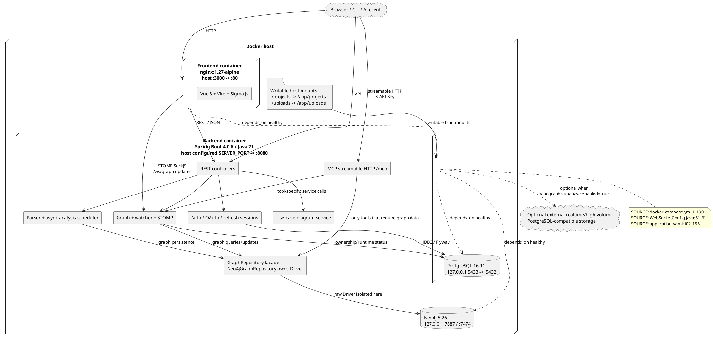
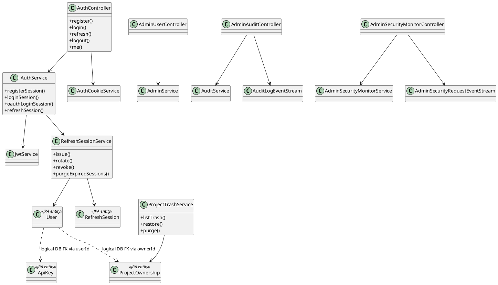
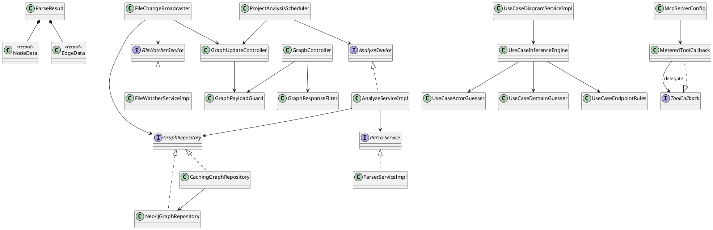

# VibeGraph - Verified ERD, Component and Class Diagrams

## PART 1: PostgreSQL control-plane ERD

```plantuml
@startuml
hide circle
skinparam linetype ortho

entity users {
  * id : UUID <<PK>>
  --
  * email : VARCHAR
  password_hash : VARCHAR?
  display_name : VARCHAR?
  avatar_url : VARCHAR?
  email_verified : BOOLEAN
  role : VARCHAR
  quota_bytes : BIGINT
  used_bytes : BIGINT
  deactivated : BOOLEAN
  deactivated_at : TIMESTAMPTZ?
  deactivation_reason : VARCHAR?
  deactivation_reason_safe : VARCHAR?
  created_at : TIMESTAMPTZ
  updated_at : TIMESTAMPTZ
}
entity user_identities {
  * id : UUID <<PK>>
  user_id : UUID <<FK>>
  provider : VARCHAR
  provider_user_id : VARCHAR
  email : VARCHAR?
  created_at : TIMESTAMPTZ
}
entity projects {
  * project_id : VARCHAR <<PK>>
  owner_id : UUID <<FK>>
  name : VARCHAR
  source_type : VARCHAR
  size_bytes : BIGINT
  status : VARCHAR
  deleted_at : TIMESTAMPTZ?
  created_at : TIMESTAMPTZ
  updated_at : TIMESTAMPTZ
}
entity api_keys {
  * id : UUID <<PK>>
  user_id : UUID <<FK>>
  project_id : VARCHAR? <<FK>>
  key_hash : VARCHAR <<UNIQUE>>
  key_prefix : VARCHAR
  name : VARCHAR?
  created_at : TIMESTAMPTZ
  last_used_at : TIMESTAMPTZ?
  expires_at : TIMESTAMPTZ?
  disabled_at : TIMESTAMPTZ?
  deleted_at : TIMESTAMPTZ?
  disabled_by : VARCHAR?
  disabled_reason : VARCHAR?
  locked_by : VARCHAR?
}
entity plans {
  * id : UUID <<PK>>
  code : VARCHAR <<UNIQUE>>
  name : VARCHAR
  storage_limit_bytes : BIGINT
  api_key_limit : INTEGER
  monthly_credit_limit : INTEGER
  contact_sales_required : BOOLEAN
  is_active : BOOLEAN
  sort_order : INTEGER
  created_at : TIMESTAMPTZ
  updated_at : TIMESTAMPTZ
}
entity user_account_settings {
  * user_id : UUID <<PK/FK>>
  plan_id : UUID <<FK>>
  storage_quota_override_bytes : BIGINT?
  credit_quota_override : INTEGER?
  api_key_creation_disabled : BOOLEAN
  blocked_at : TIMESTAMPTZ?
  blocked_reason : VARCHAR?
  blocked_reason_safe : VARCHAR?
  created_at : TIMESTAMPTZ
  updated_at : TIMESTAMPTZ
}
entity project_usage {
  * project_id : VARCHAR <<PK/FK>>
  owner_id : UUID <<FK>>
  storage_bytes : BIGINT
  updated_at : TIMESTAMPTZ
}
entity user_credit_balances {
  * id : UUID <<PK>>
  user_id : UUID <<FK>>
  period_start : DATE
  period_end : DATE
  credits_limit_snapshot : INTEGER
  credits_used : INTEGER
  credits_adjustment : INTEGER
  created_at : TIMESTAMPTZ
  updated_at : TIMESTAMPTZ
}
entity credit_pricing_rules {
  * id : UUID <<PK>>
  operation_code : VARCHAR <<UNIQUE>>
  display_name : VARCHAR
  base_credits : NUMERIC
  per_file_credits : NUMERIC
  per_mb_credits : NUMERIC
  per_1k_nodes_credits : NUMERIC
  minimum_credits : INTEGER
  is_active : BOOLEAN
  created_at : TIMESTAMPTZ
  updated_at : TIMESTAMPTZ
}
entity credit_ledger {
  * id : UUID <<PK>>
  user_id : UUID <<FK>>
  project_id : VARCHAR? <<FK>>
  balance_id : UUID? <<FK>>
  source : VARCHAR
  operation_code : VARCHAR
  credits_delta : INTEGER
  metadata : JSONB
  created_at : TIMESTAMPTZ
}
entity feature_flags {
  * id : UUID <<PK>>
  flag_key : VARCHAR <<UNIQUE>>
  scope : VARCHAR
  display_name : VARCHAR
  description : VARCHAR?
  enabled : BOOLEAN
  created_at : TIMESTAMPTZ
  updated_at : TIMESTAMPTZ
}
entity announcements {
  * id : UUID <<PK>>
  type : VARCHAR
  severity : VARCHAR
  target : VARCHAR
  title : VARCHAR
  body : VARCHAR
  starts_at : TIMESTAMPTZ?
  ends_at : TIMESTAMPTZ?
  dismissible : BOOLEAN
  active : BOOLEAN
  created_by_user_id : UUID? <<FK>>
  created_at : TIMESTAMPTZ
  updated_at : TIMESTAMPTZ
}
entity user_notifications {
  * id : UUID <<PK>>
  user_id : UUID <<FK>>
  announcement_id : UUID <<FK>>
  read_at : TIMESTAMPTZ?
  dismissed_at : TIMESTAMPTZ?
  created_at : TIMESTAMPTZ
}
entity feedback_reports {
  * id : UUID <<PK>>
  user_id : UUID? <<FK>>
  status : VARCHAR
  category : VARCHAR
  title : VARCHAR
  delete_after : TIMESTAMPTZ?
  created_at : TIMESTAMPTZ
  closed_at : TIMESTAMPTZ?
}
entity feedback_messages {
  * id : UUID <<PK>>
  report_id : UUID <<FK>>
  sender_user_id : UUID? <<FK>>
  sender_role : VARCHAR
  body : TEXT
  created_at : TIMESTAMPTZ
}
entity security_events {
  * id : UUID <<PK>>
  event_type : VARCHAR
  severity : VARCHAR
  subject_user_id : UUID? <<FK>>
  api_key_ref : VARCHAR?
  source : VARCHAR?
  description : VARCHAR?
  created_at : TIMESTAMPTZ
}
entity request_events {
  * id : UUID <<PK>>
  user_id : UUID? <<FK>>
  api_key_ref : VARCHAR?
  ip_address : VARCHAR
  route : VARCHAR
  http_method : VARCHAR
  status : INTEGER
  event_type : VARCHAR
  occurred_at : TIMESTAMPTZ
}
entity ip_blocks {
  * id : UUID <<PK>>
  ip_address : VARCHAR <<UNIQUE>>
  safe_reason : VARCHAR
  expires_at : TIMESTAMPTZ?
  created_by : UUID? <<FK>>
  active : BOOLEAN
  created_at : TIMESTAMPTZ
  updated_at : TIMESTAMPTZ
}
entity audit_logs {
  * id : UUID <<PK>>
  action : VARCHAR
  actor_user_id : UUID? <<logical ref; no FK after V15>>
  target_user_id : UUID? <<logical ref; no FK after V15>>
  target_type : VARCHAR?
  target_id : VARCHAR?
  outcome : VARCHAR
  ip_address : VARCHAR?
  details : VARCHAR
  created_at : TIMESTAMPTZ
}
entity audit_retention_settings {
  * id : SMALLINT <<PK>>
  retention_days : INTEGER
  updated_by : UUID? <<FK>>
  updated_at : TIMESTAMPTZ
}
entity refresh_sessions {
  * id : UUID <<PK>>
  user_id : UUID <<FK>>
  family_id : UUID
  token_hash : VARCHAR <<UNIQUE>>
  expires_at : TIMESTAMPTZ
  last_used_at : TIMESTAMPTZ?
  revoked_at : TIMESTAMPTZ?
  revoke_reason : VARCHAR?
  replaced_by_id : UUID?
  created_at : TIMESTAMPTZ
}

users ||--o{ user_identities
users ||--o{ projects
users ||--o{ api_keys
projects |o--o{ api_keys
users ||--o| user_account_settings
plans ||--o{ user_account_settings
projects ||--o| project_usage
users ||--o{ project_usage
users ||--o{ user_credit_balances
users ||--o{ credit_ledger
projects |o--o{ credit_ledger
user_credit_balances |o--o{ credit_ledger
users |o--o{ announcements : created_by
users ||--o{ user_notifications
announcements ||--o{ user_notifications
users |o--o{ feedback_reports
feedback_reports ||--o{ feedback_messages
users |o--o{ feedback_messages
users |o--o{ security_events
users |o--o{ request_events
users |o--o{ ip_blocks : created_by
users |o--o{ audit_retention_settings : updated_by
users ||--o{ refresh_sessions

note bottom
MIGRATION: src/main/resources/db/migration/V1..V20__*.sql
RUNTIME 2026-08-14T10:12:42+07:00: 21 domain tables, 23 FK relations,
66 domain-table indexes (68 public-schema indexes including 2 Flyway indexes),
and 19 successful Flyway migrations.
Important unique indexes: uq_users_email_lower, uq_identity_provider_uid,
uq_credit_balance_user_period, uq_user_notifications_user_announcement,
and partial uq_api_keys_live_user_project.
end note
@enduml
```

## PART 2: Neo4j graph schema and observed runtime vocabulary

## PART 3: Component and deployment

## PART 4: Auth/control-plane class view

## PART 5: Graph/parser/diagram/MCP class view

The class views are verified compact module views, not an exhaustive rendering of all 17,907
indexed symbols. `Plan`, `UserCreditBalance`, `CreditLedger`, `AuditLog`, `FeatureFlag`, `Role`,
`GraphService` and `ProjectService` remain in production code but are omitted from these compact
slices. Exact source locations and old-versus-current decisions are in the change notes.
