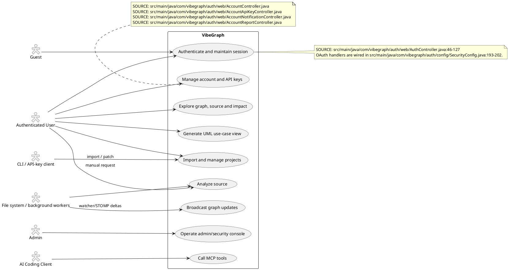
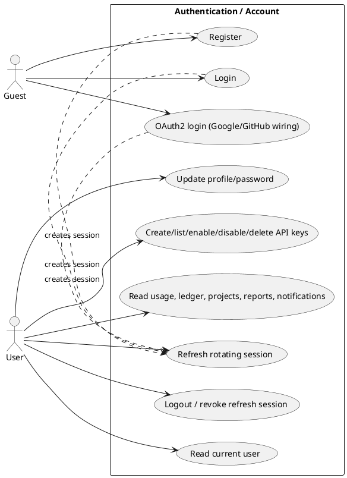
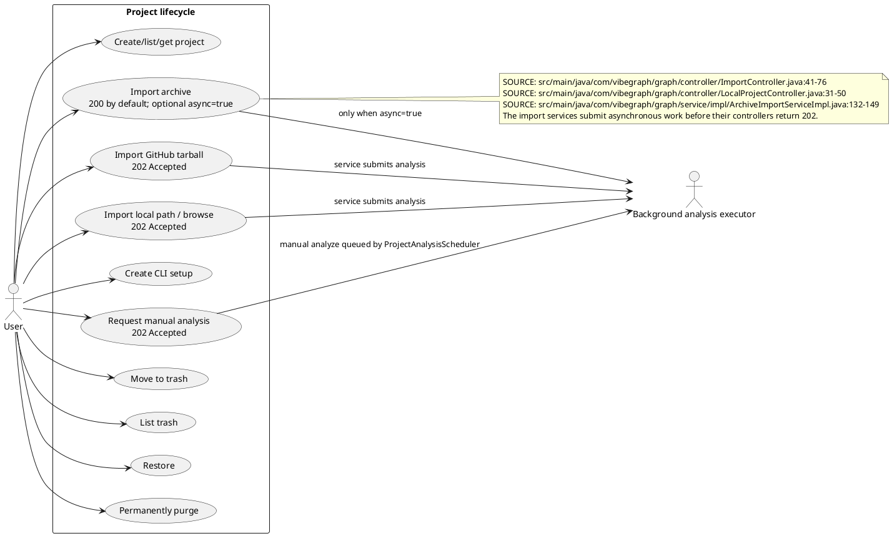
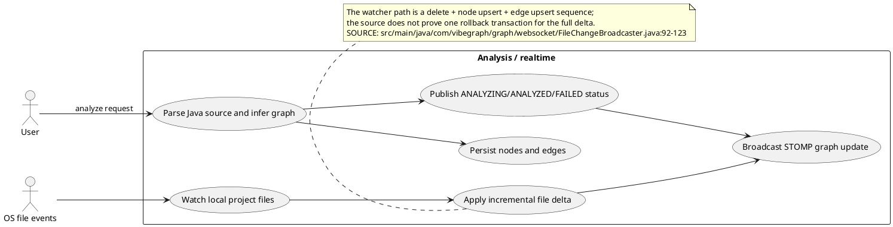
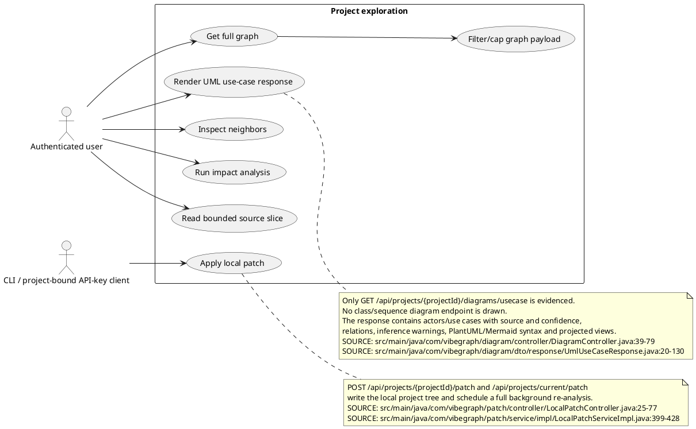
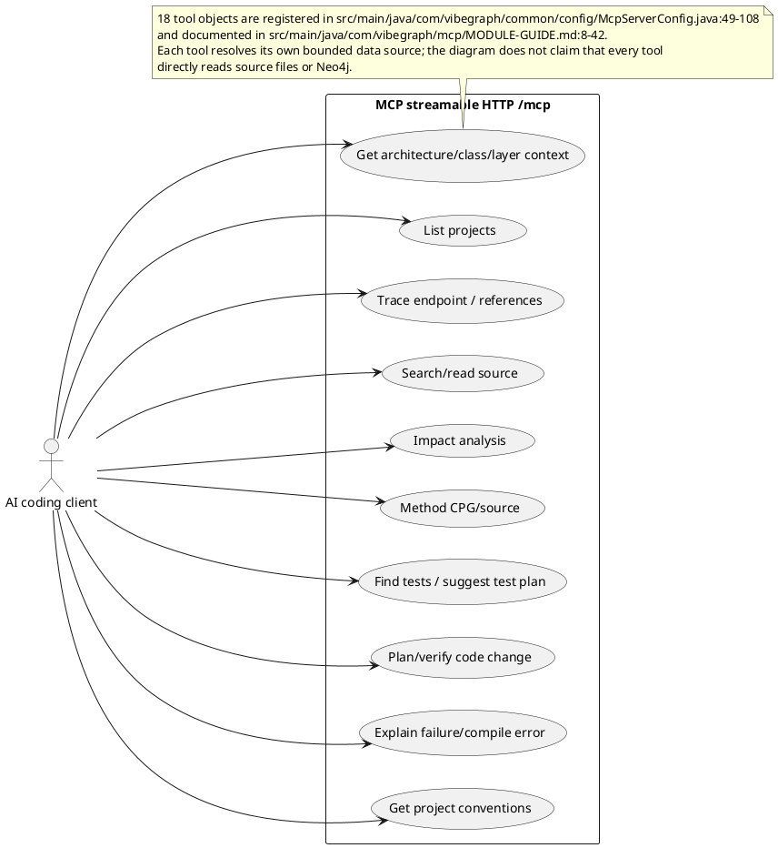
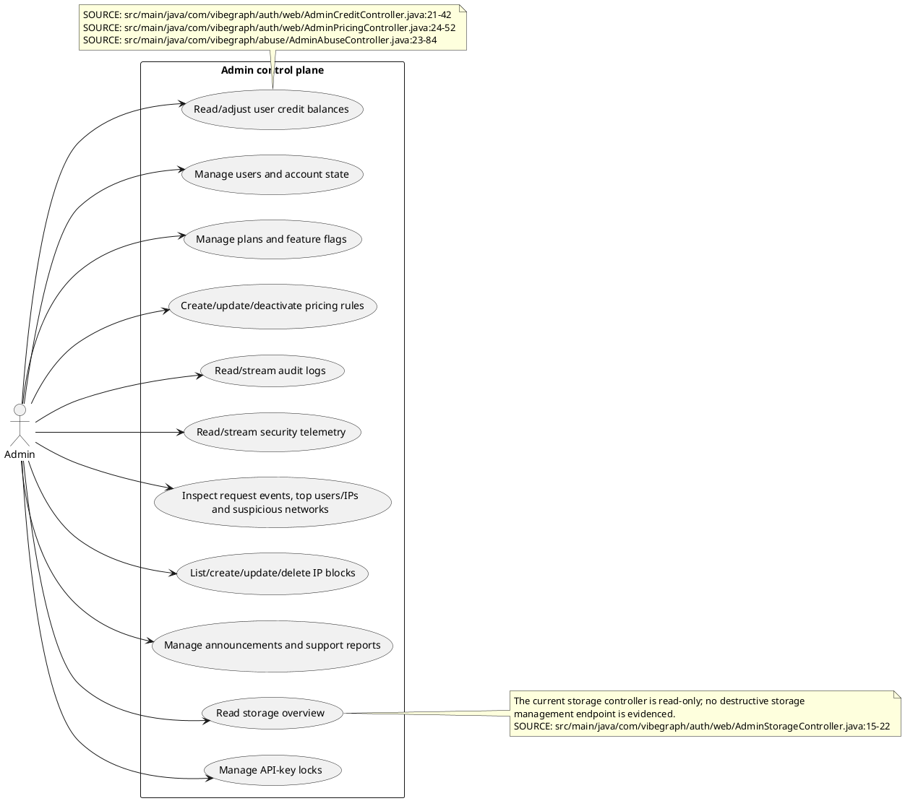

# VibeGraph - Verified Use Case Diagrams

These diagrams describe capabilities evidenced by the current source/configuration. They do
not reproduce unsupported claims from the previous report. Evidence references use the
repository-relative `path:line` form.

## 2.1. Current system boundary

## 2.2. Authentication and account

## 2.3. Project lifecycle and import

## 2.4. Source analysis and realtime

## 2.5. Graph, source, patch and UML

## 2.6. MCP and AI client

## 2.7. Admin and security operations

## Not drawn as current behavior

The old diagrams mention forgot-password, email verification, GitLab import, class/sequence
diagram generation, broad PNG/SVG export, and a 3D graph. Repository search found no current
endpoint/service contract proving those features, so they are documented as stale in
`changes/usecase.changes.md` rather than represented as live use cases.
