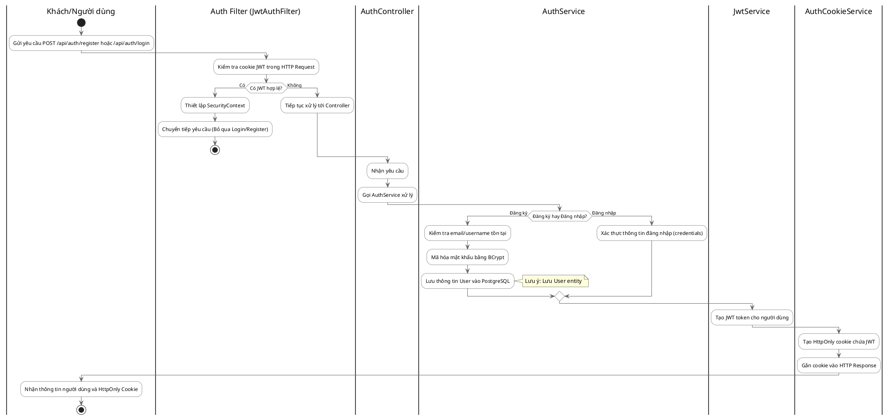
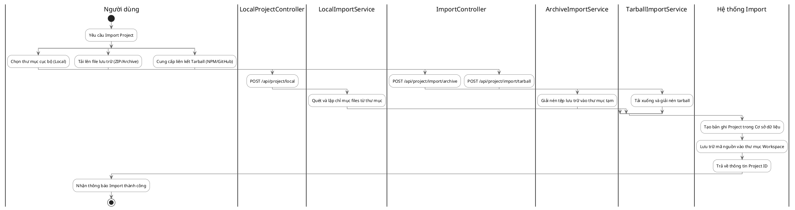
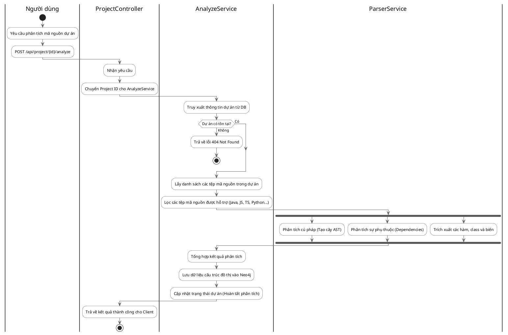
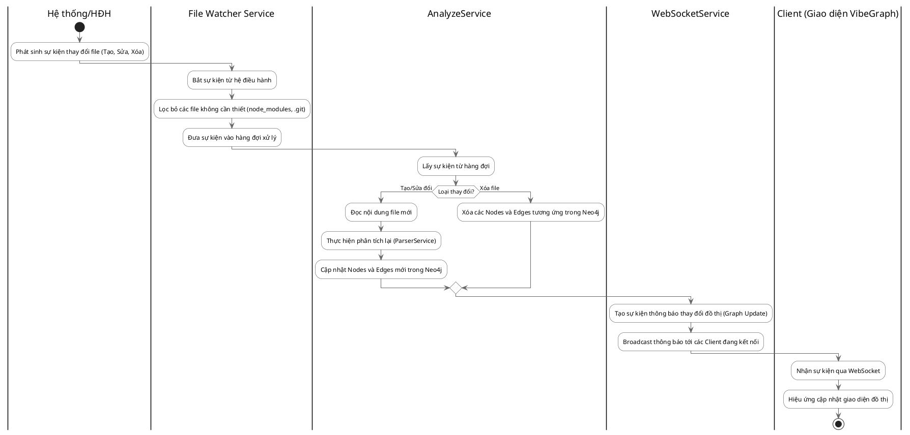
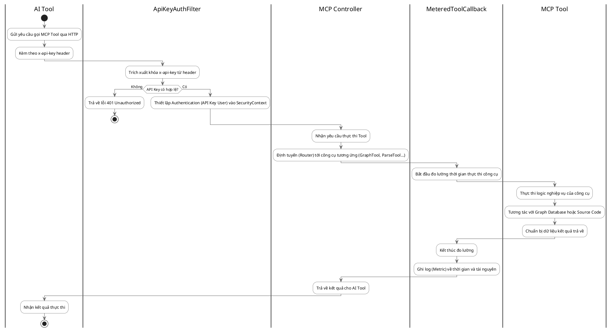
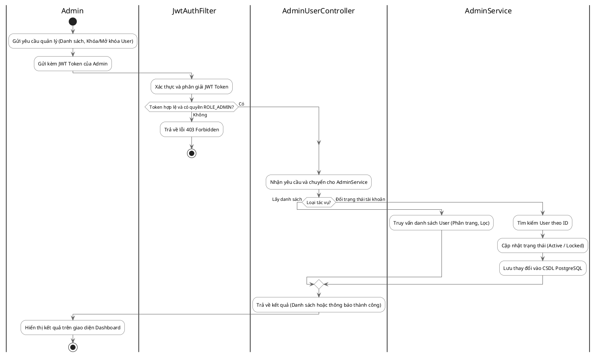

# VibeGraph Activity Diagrams

Tài liệu này chứa các sơ đồ hoạt động (Activity Diagrams) mô tả các luồng nghiệp vụ chính của dự án VibeGraph.

## Diagram 3.1: Đăng ký → Đăng nhập → Xác thực JWT

## Diagram 3.2: Import Project

## Diagram 3.3: Phân tích mã nguồn (Analyze)

## Diagram 3.4: Realtime Update (File Watcher)

## Diagram 3.5: AI Tool gọi MCP

## Diagram 3.6: Admin quản lý người dùng

