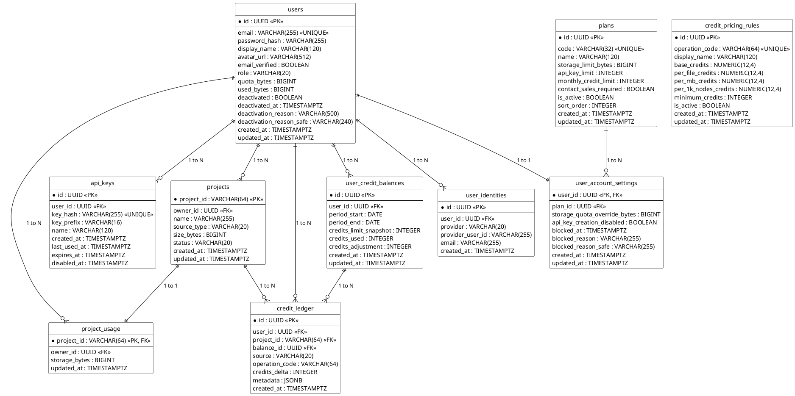
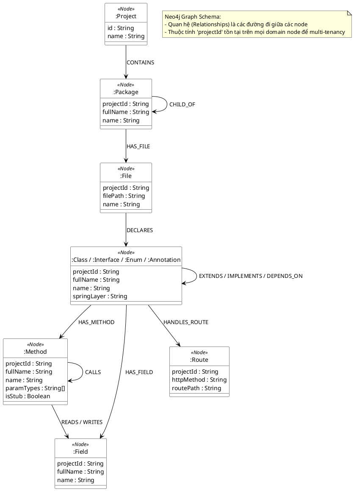
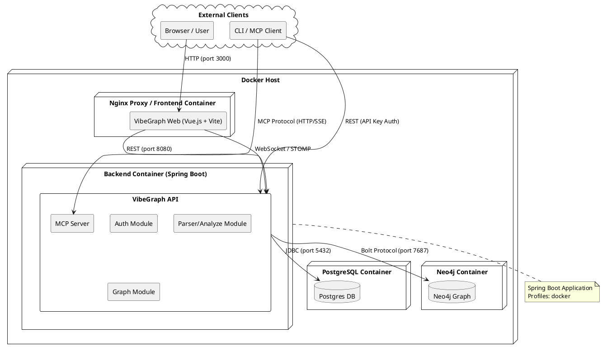
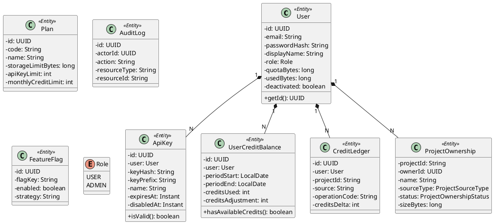
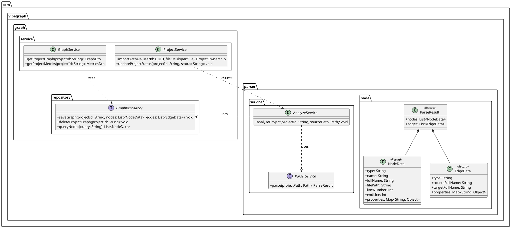

# VibeGraph - Architecture & Database Diagrams

Tài liệu này chứa toàn bộ các biểu đồ ERD (PostgreSQL & Neo4j), Component/Deployment và Class Diagrams cho hệ thống VibeGraph, được định dạng bằng cú pháp PlantUML.

## PART 1: ERD PostgreSQL

## PART 2: ERD Neo4j

## PART 3: Component/Deployment Diagram

## PART 4: Class Diagram - Auth Module

## PART 5: Class Diagram - Graph/Parser Module

