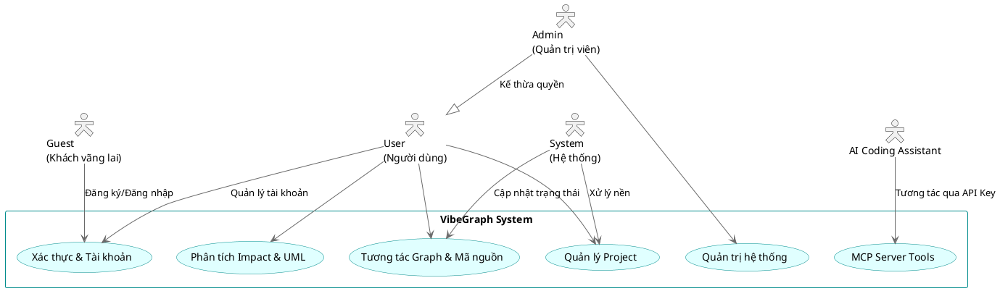
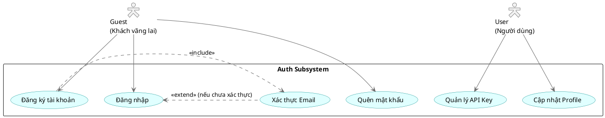
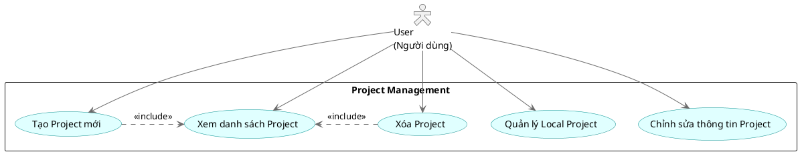
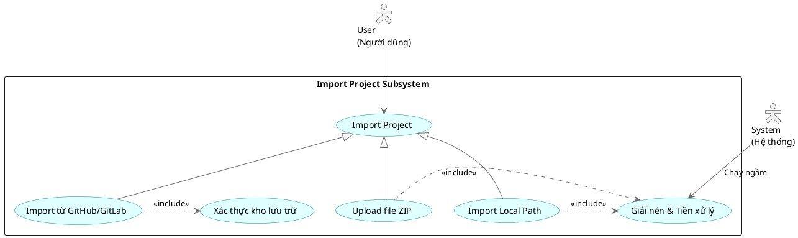
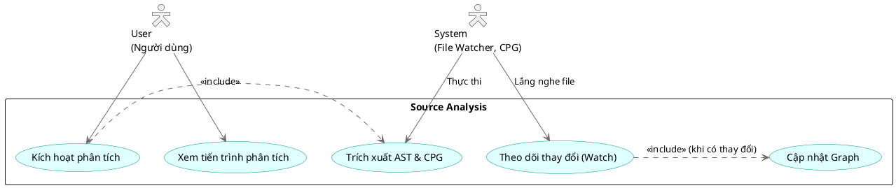
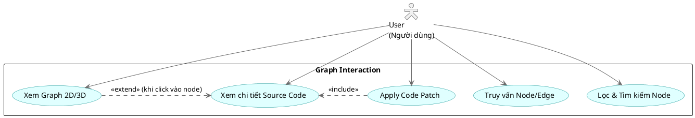
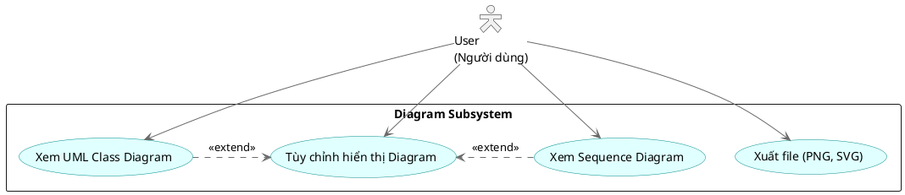
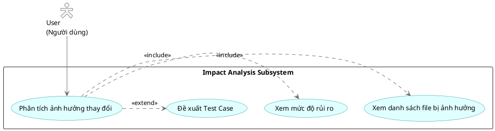
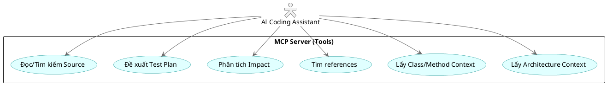
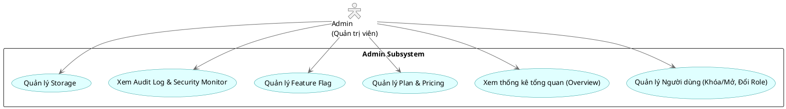

# VibeGraph - Use Case Diagrams

Tài liệu này chứa tất cả các biểu đồ Use Case (Use Case Diagrams) cho dự án VibeGraph, được viết bằng cú pháp PlantUML.

## 2.1. Use Case Tổng quát

## 2.2. UC: Đăng ký & Đăng nhập (Guest)

## 2.3. UC: Quản lý Project (User)

## 2.4. UC: Import Project - 3 luồng (User)

## 2.5. UC: Phân tích mã nguồn (User, System)

## 2.6. UC: Xem & Tương tác Graph (User)

## 2.7. UC: Xem UML Diagram (User)

## 2.8. UC: Impact Analysis (User)

## 2.9. UC: MCP Server (AI Assistant)

## 2.10. UC: Quản trị hệ thống (Admin)

