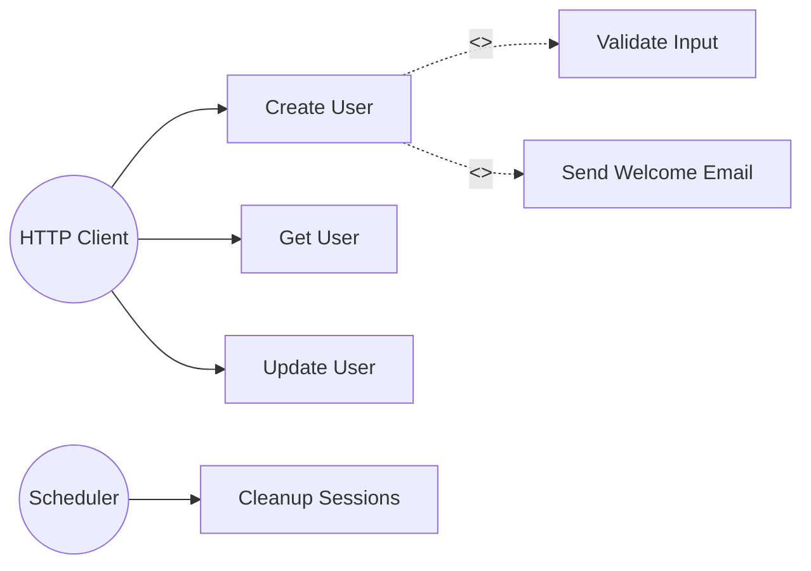
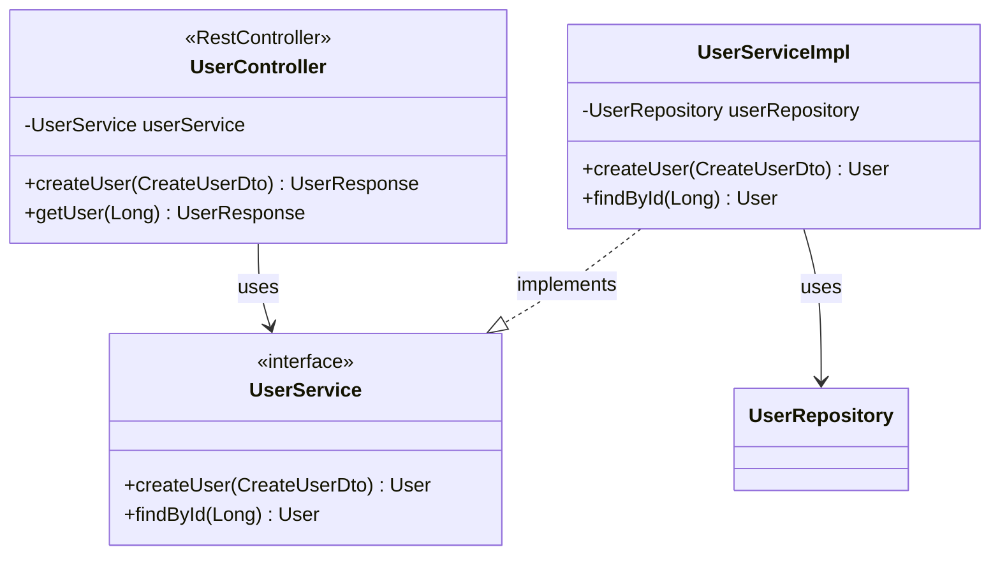

# Module: diagram

## Mục đích
Module generate UML diagrams từ knowledge graph, output dạng Mermaid.js syntax.

> **Scope 2-month:** Use Case + Class diagram. Sequence diagram defer post-2-month (FR-06 deferred).

## Cấu trúc

```
diagram/
├── controller/
│   └── DiagramController.java      — GET /api/projects/{id}/diagrams/*
├── service/
│   ├── UseCaseDiagramService.java  — Interface: generate use case diagram
│   ├── ClassDiagramService.java    — Interface: generate class diagram
│   ├── MermaidGeneratorService.java — Interface: convert to Mermaid syntax
│   └── impl/
│       ├── UseCaseDiagramServiceImpl.java
│       ├── ClassDiagramServiceImpl.java
│       └── MermaidGeneratorServiceImpl.java
├── repository/
│   └── DiagramQueryRepository.java — Custom Cypher queries for diagram data
├── node/
│   └── DiagramData.java            — Internal model for diagram elements
└── dto/
    └── response/
        ├── DiagramResponse.java    — {mermaidSyntax, type, generatedAt}
        └── UseCaseResponse.java    — {actors[], useCases[], relationships[]}
```

## Yêu cầu chức năng

### DiagramController
- [ ] `GET /api/projects/{id}/diagrams/usecase`: Generate Use Case diagram
- [ ] `GET /api/projects/{id}/diagrams/class?package=...`: Generate Class diagram (filter by package)

### Use Case Diagram (FR-04)
- [ ] Detect **Actors** từ:
  - @RestController endpoints → Actor: "HTTP Client"
  - @Scheduled methods → Actor: "System/Scheduler"
  - @KafkaListener methods → Actor: "Message Queue"
  - @EventListener methods → Actor: "Event Bus"
- [ ] Detect **Use Cases** từ:
  - Public methods trong @RestController (mỗi endpoint = 1 use case)
  - Use case name = method name hoặc @Operation summary
- [ ] Detect **Relationships**:
  - `<<include>>`: Khi use case gọi shared service method
  - `<<extend>>`: Khi có optional flow (validation, notification)
- [ ] Output: Mermaid flowchart LR syntax

### Class Diagram (FR-05)
- [ ] Show classes với:
  - Fields (visibility indicators: +public, -private, #protected)
  - Methods (visibility indicators)
  - Stereotypes: <<interface>>, <<abstract>>, <<enum>>
- [ ] Show relationships:
  - Inheritance: `--|>` (EXTENDS edge)
  - Implementation: `..|>` (IMPLEMENTS edge)
  - Association: `-->` (field type reference)
  - Dependency: `..>` (INJECTS edge từ @Autowired)
- [ ] Filter by package (chỉ show classes trong package đó)
- [ ] Output: Mermaid classDiagram syntax

### MermaidGeneratorService
- [ ] `generateUseCaseMermaid(UseCaseData)`: Convert to Mermaid flowchart
- [ ] `generateClassMermaid(ClassDiagramData)`: Convert to Mermaid classDiagram
- [ ] Escape special characters trong names
- [ ] Handle long names (truncate hoặc wrap)

## Mermaid Output Examples

### Use Case


### Class Diagram


## Quy tắc code

1. **Query optimization**: Dùng single Cypher query để fetch diagram data, không N+1
2. **Caching**: Cache generated diagrams (invalidate khi graph thay đổi)
3. **Size limits**: Limit số elements trong diagram (max 50 classes per package)
4. **Readable output**: Format Mermaid syntax với proper indentation

## Performance Targets

| Metric | Target |
|--------|--------|
| Use Case diagram generation | < 1 second |
| Class diagram (1 package) | < 500ms |

## Acceptance Criteria

- [ ] Use Case diagram detect actors từ Spring annotations
- [ ] Use Case diagram show <<include>>/<<extend>> relationships
- [ ] Class diagram show đúng visibility indicators
- [ ] Class diagram show inheritance/implementation relationships
- [ ] Mermaid syntax valid (render được trong Mermaid Live Editor)
- [ ] Auto-update diagrams khi graph thay đổi
- [ ] Unit tests với sample graph data

## Deferred (post-2-month)

- Sequence diagram (FR-06) — trace call chain từ entry point
